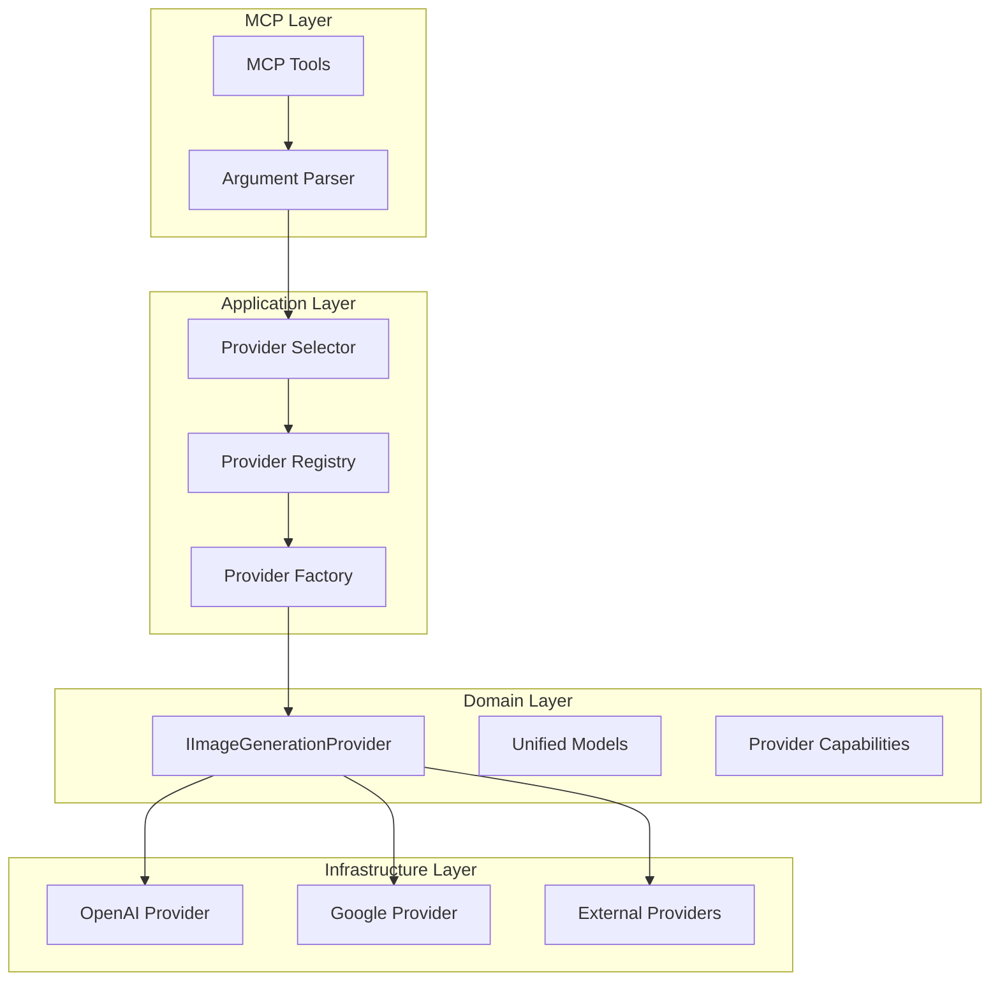

# Architecture Improvement Plan - AiGeekSquad.ImageGenerator

## Executive Summary
Complete architectural overhaul of the image generation MCP server to improve testability, extensibility, and maintainability. No backward compatibility constraints as the project hasn't been published.

## Current Issues

### 1. Architecture Problems
- **Provider Management:** Parameterless constructor requirement prevents DI
- **Static Dependencies:** Static HttpClient in base class
- **Tight Coupling:** Direct SDK dependencies, hardcoded provider defaults
- **Mixed Responsibilities:** Classes violating SRP
- **Request/Response Duality:** Two parallel message formats causing complexity

### 2. Testing Gaps
- No MCP tool E2E tests
- Missing argument parsing tests
- Mixed unit/integration tests
- No clear test boundaries
- Environment-dependent test execution

## Proposed Architecture

### Core Design Principles
- **SOLID Principles:** Strict adherence
- **Clean Architecture:** Clear layer separation
- **Testability First:** All components easily testable
- **DI Throughout:** Full dependency injection support

### Component Architecture



## Implementation Plan

### Phase 1: Core Refactoring (Week 1)

#### 1.1 Provider Factory Pattern
```csharp
public interface IProviderFactory
{
    string Name { get; }
    IImageGenerationProvider Create(IServiceProvider services);
    ProviderMetadata GetMetadata();
    bool CanCreate(IServiceProvider services);
}

public class ProviderRegistry : IProviderRegistry
{
    private readonly IEnumerable<IProviderFactory> _factories;
    
    public IImageGenerationProvider? GetProvider(string name)
    {
        var factory = _factories.FirstOrDefault(f => 
            f.Name.Equals(name, StringComparison.OrdinalIgnoreCase));
        return factory?.CanCreate(_services) == true 
            ? factory.Create(_services) 
            : null;
    }
}
```

#### 1.2 Unified Request/Response Models
```csharp
public class UnifiedImageRequest
{
    public string Prompt { get; set; }
    public List<ImageReference>? Images { get; set; }
    public string? Model { get; set; }
    public ImageParameters Parameters { get; set; }
}

public interface IRequestAdapter
{
    UnifiedImageRequest Adapt(object source);
}
```

#### 1.3 Provider Selection Strategy
```csharp
public interface IProviderSelectionStrategy
{
    IImageGenerationProvider SelectProvider(
        ProviderSelectionContext context);
}

public class SmartProviderSelector : IProviderSelectionStrategy
{
    public IImageGenerationProvider SelectProvider(
        ProviderSelectionContext context)
    {
        // 1. Explicit provider requested
        // 2. Model-based selection
        // 3. Capability-based selection
        // 4. Load balancing
        // 5. Fallback chain
    }
}
```

### Phase 2: MCP Tool Improvements (Week 2)

#### 2.1 Argument Parser
```csharp
public interface IArgumentParser
{
    ParsedArguments Parse(Dictionary<string, object?> mcpArgs);
    ValidationResult Validate(ParsedArguments args);
}

public class McpArgumentParser : IArgumentParser
{
    public ParsedArguments Parse(Dictionary<string, object?> args)
    {
        // Type-safe parsing with validation
        // Handle optional parameters
        // Provide defaults
        // Parse complex types (JSON arrays, etc.)
    }
}
```

#### 2.2 Enhanced MCP Tools
```csharp
[McpServerTool]
public async Task<string> GenerateImage(
    Dictionary<string, object?> args)
{
    // Parse and validate arguments
    var parsed = _argumentParser.Parse(args);
    var validation = _argumentParser.Validate(parsed);
    
    if (!validation.IsValid)
        return JsonSerializer.Serialize(new { 
            error = validation.Errors 
        });
    
    // Smart provider selection
    var provider = _providerSelector.SelectProvider(
        new ProviderSelectionContext
        {
            PreferredProvider = parsed.Provider,
            Model = parsed.Model,
            Operation = ImageOperation.Generate,
            Capabilities = parsed.RequiredCapabilities
        });
    
    // Execute with telemetry
    using var activity = Activity.StartActivity("GenerateImage");
    // ... implementation
}
```

### Phase 3: Comprehensive Testing (Week 3)

#### 3.1 Test Structure
```
tests/
├── Unit/
│   ├── ArgumentParsing/
│   │   ├── McpArgumentParserTests.cs
│   │   ├── ValidationTests.cs
│   │   └── TypeConversionTests.cs
│   ├── Providers/
│   │   ├── ProviderFactoryTests.cs
│   │   ├── ProviderRegistryTests.cs
│   │   └── ProviderSelectorTests.cs
│   └── Services/
│       └── ImageGenerationServiceTests.cs
├── Integration/
│   ├── Providers/
│   │   ├── OpenAI/
│   │   └── Google/
│   └── ExternalProviders/
├── E2E/
│   ├── McpTools/
│   │   ├── GenerateImageE2ETests.cs
│   │   ├── EditImageE2ETests.cs
│   │   ├── ConversationalE2ETests.cs
│   │   └── ListProvidersE2ETests.cs
│   ├── McpProtocol/
│   │   ├── ProtocolComplianceTests.cs
│   │   ├── ErrorHandlingTests.cs
│   │   └── ConcurrencyTests.cs
│   └── Scenarios/
│       ├── MultiProviderScenarios.cs
│       ├── FallbackScenarios.cs
│       └── LoadTestScenarios.cs
└── Shared/
    ├── Fixtures/
    ├── Builders/
    └── TestDoubles/
```

#### 3.2 MCP E2E Test Implementation
```csharp
[Trait("Category", "E2E")]
[Trait("Component", "McpTools")]
public class GenerateImageE2ETests : IClassFixture<McpServerFixture>
{
    private readonly McpServerFixture _fixture;
    
    [Fact]
    public async Task GenerateImage_ParsesAllArguments_Correctly()
    {
        // Arrange
        var mcpRequest = new
        {
            tool = "generate_image",
            arguments = new
            {
                prompt = "A beautiful sunset",
                provider = "OpenAI",
                model = "dall-e-3",
                size = "1024x1024",
                quality = "hd",
                style = "vivid",
                numberOfImages = 2
            }
        };
        
        // Act
        var response = await _fixture.SendMcpRequest(mcpRequest);
        
        // Assert
        response.Should().NotBeNull();
        var result = JsonSerializer.Deserialize<ImageGenerationResponse>(
            response.Content);
        
        using var scope = new AssertionScope();
        result.Provider.Should().Be("OpenAI");
        result.Model.Should().Be("dall-e-3");
        result.Images.Should().HaveCount(2);
    }
    
    [Fact]
    public async Task GenerateImage_HandlesInvalidArguments()
    {
        // Test various invalid argument combinations
        var invalidRequests = new[]
        {
            new { prompt = (string?)null },  // Missing required
            new { prompt = "", size = "invalid" },  // Invalid size
            new { prompt = "test", numberOfImages = -1 }  // Invalid count
        };
        
        foreach (var request in invalidRequests)
        {
            var response = await _fixture.SendMcpRequest(
                "generate_image", request);
            
            response.Should().ContainError();
        }
    }
    
    [Fact]
    public async Task GenerateImage_ProviderFallback_Works()
    {
        // Arrange - configure primary provider to fail
        _fixture.ConfigureProviderToFail("OpenAI");
        
        var request = new
        {
            prompt = "Test image",
            provider = "OpenAI"  // Will fail and fallback
        };
        
        // Act
        var response = await _fixture.SendMcpRequest(
            "generate_image", request);
        
        // Assert
        response.Should().BeSuccessful();
        var result = JsonSerializer.Deserialize<ImageGenerationResponse>(
            response.Content);
        result.Provider.Should().NotBe("OpenAI");
    }
}
```

#### 3.3 Argument Parsing Tests
```csharp
[Trait("Category", "Unit")]
public class McpArgumentParserTests
{
    private readonly McpArgumentParser _parser = new();
    
    [Theory]
    [InlineData("1024x1024", 1024, 1024)]
    [InlineData("1792x1024", 1792, 1024)]
    [InlineData("1024x1792", 1024, 1792)]
    public void ParseSize_ValidFormats_ParsesCorrectly(
        string input, int expectedWidth, int expectedHeight)
    {
        var result = _parser.ParseSize(input);
        
        result.Width.Should().Be(expectedWidth);
        result.Height.Should().Be(expectedHeight);
    }
    
    [Theory]
    [InlineData(null, "1024x1024")]  // Default
    [InlineData("", "1024x1024")]    // Empty default
    [InlineData("invalid", null)]    // Invalid returns null
    public void ParseSize_EdgeCases_HandledCorrectly(
        string? input, string? expected)
    {
        var result = _parser.ParseSize(input);
        
        if (expected != null)
        {
            var parts = expected.Split('x');
            result.Width.Should().Be(int.Parse(parts[0]));
            result.Height.Should().Be(int.Parse(parts[1]));
        }
        else
        {
            result.Should().BeNull();
        }
    }
    
    [Fact]
    public void ParseConversationJson_ValidJson_ParsesCorrectly()
    {
        var json = @"[
            {""role"":""user"",""text"":""Hello""},
            {""role"":""assistant"",""text"":""Hi""}
        ]";
        
        var result = _parser.ParseConversation(json);
        
        result.Should().HaveCount(2);
        result[0].Role.Should().Be("user");
        result[1].Role.Should().Be("assistant");
    }
    
    [Fact]
    public void ValidateArguments_MissingRequired_ReturnsErrors()
    {
        var args = new ParsedArguments { Prompt = null };
        
        var validation = _parser.Validate(args);
        
        validation.IsValid.Should().BeFalse();
        validation.Errors.Should().Contain("Prompt is required");
    }
}
```

#### 3.4 MCP Protocol Tests
```csharp
[Trait("Category", "E2E")]
[Trait("Component", "McpProtocol")]
public class McpProtocolComplianceTests : IClassFixture<McpServerFixture>
{
    [Fact]
    public async Task McpServer_LogsToStderr_NotStdout()
    {
        // Arrange
        using var stdoutCapture = new StdoutCapture();
        using var stderrCapture = new StderrCapture();
        
        // Act
        await _fixture.SendMcpRequest("list_providers", new {});
        
        // Assert
        stdoutCapture.Output.Should().ContainOnly(
            "Valid JSON-RPC responses");
        stderrCapture.Output.Should().Contain(
            "log messages");
    }
    
    [Fact]
    public async Task McpServer_HandlesMultipleRequests_Concurrently()
    {
        // Arrange
        var tasks = Enumerable.Range(0, 10)
            .Select(i => _fixture.SendMcpRequest(
                "generate_image", 
                new { prompt = $"Image {i}" }));
        
        // Act
        var responses = await Task.WhenAll(tasks);
        
        // Assert
        responses.Should().AllSatisfy(r => 
            r.Should().BeSuccessful());
    }
}
```

### Phase 4: Performance & Observability (Week 4)

#### 4.1 Telemetry
```csharp
public class TelemetryProvider : IImageGenerationProvider
{
    private readonly IImageGenerationProvider _inner;
    private readonly IMetrics _metrics;
    
    public async Task<ImageGenerationResponse> GenerateImageAsync(
        UnifiedImageRequest request,
        CancellationToken cancellationToken)
    {
        using var activity = Activity.StartActivity("GenerateImage");
        activity?.SetTag("provider", _inner.ProviderName);
        activity?.SetTag("model", request.Model);
        
        var stopwatch = Stopwatch.StartNew();
        try
        {
            var response = await _inner.GenerateImageAsync(
                request, cancellationToken);
            
            _metrics.RecordSuccess(
                _inner.ProviderName, 
                stopwatch.Elapsed);
            
            return response;
        }
        catch (Exception ex)
        {
            _metrics.RecordFailure(
                _inner.ProviderName, 
                ex.GetType().Name);
            throw;
        }
    }
}
```

## Success Criteria

### Functional
- [ ] All existing tests pass
- [ ] New E2E MCP tool tests pass
- [ ] Argument parsing handles all edge cases
- [ ] Provider fallback works correctly
- [ ] External provider loading with DI works

### Non-Functional
- [ ] 100% unit test coverage for new components
- [ ] E2E tests cover all MCP tools
- [ ] Performance: <100ms overhead per request
- [ ] Clear separation between unit/integration/E2E tests
- [ ] All components follow SOLID principles

## Migration Checklist

### Week 1: Core Refactoring
- [ ] Create provider factory abstraction
- [ ] Implement provider registry
- [ ] Create unified request/response models
- [ ] Implement provider selection strategy
- [ ] Remove static HttpClient from base class

### Week 2: MCP Improvements
- [ ] Create argument parser with validation
- [ ] Enhance MCP tools with smart selection
- [ ] Add comprehensive error handling
- [ ] Implement request context flow

### Week 3: Testing
- [ ] Set up new test project structure
- [ ] Write unit tests for all new components
- [ ] Create E2E test fixtures
- [ ] Implement MCP tool E2E tests
- [ ] Add argument parsing test suite

### Week 4: Polish
- [ ] Add telemetry and metrics
- [ ] Performance optimization
- [ ] Documentation updates
- [ ] Final testing and validation

## Risk Mitigation

### Technical Risks
1. **MCP Protocol Changes:** Use adapter pattern for protocol layer
2. **Provider API Changes:** Isolate with adapter interfaces
3. **Performance Impact:** Benchmark before/after, optimize hot paths

### Implementation Risks
1. **Scope Creep:** Strict phase boundaries
2. **Testing Complexity:** Start with test infrastructure first
3. **Integration Issues:** Incremental integration with existing code

## Notes

- No backward compatibility needed - full freedom to redesign
- Focus on testability and clean architecture
- MCP E2E tests are critical for production readiness
- Argument parsing must be robust with clear error messages